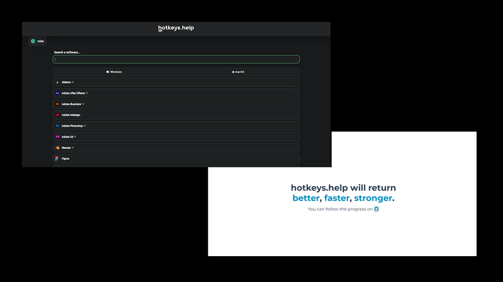

### Pitch

---

For a year-end project in Computer Science and Digital Sciences (NSI) in high school, my friend and I developed a
collaborative website that compiles software along with keyboard shortcuts and associated usage tips. 
Truly committed to the project, I continued working on it in my free time,
enhancing it with my newly acquired knowledge.

It was gratifying to have the sense of developing a useful tool.

> I haven't had the opportunity to finalize a new version, but I've learned a lot, and it's not ruled out that 
I may revisit it, refining the concept for improvement.

### Pictures

---
