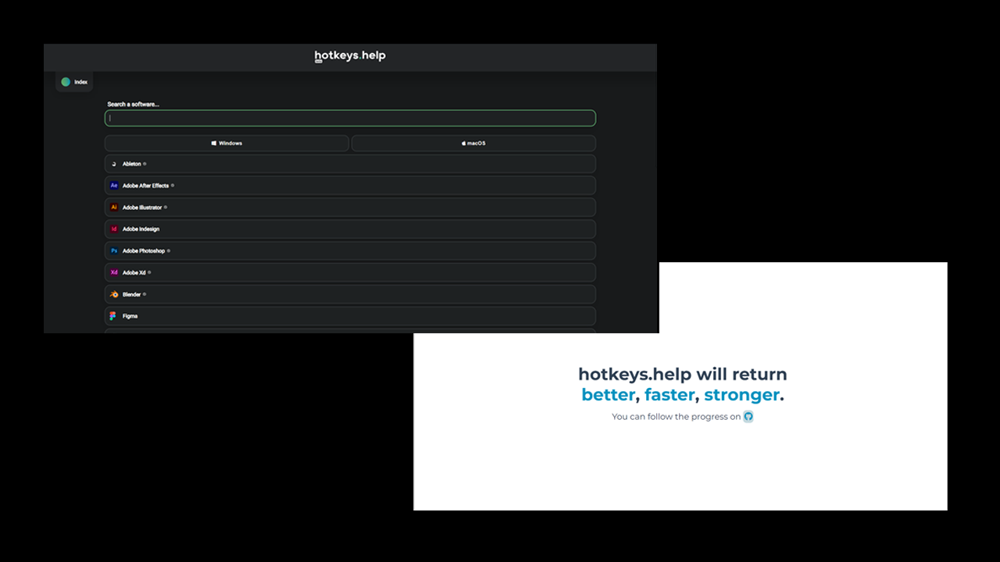

### Pitch

---
Pour un projet de fin d'année de NSI _(Numérique et sciences informatiques)_ en terminale, nous avons, avec un ami
développé un site collaboratif répertoriant des logiciels ainsi que des raccourcis claviers et conseils d'utilisations
associés.  
Étant réellement impliqué dans le projet, je l'ai poursuivi sur mon temps libre, pendant mes études, enrichi de mes
nouvelles connaissances.

Il était plaisant d'avoir le sentiment de développer un outil utile.

> Je n'ai pas eu l'occasion de finaliser une nouvelle version, mais j'ai beaucoup appris et il n'est pas exclu que je
m'y remette en améliorant le concept.

### En images

---
