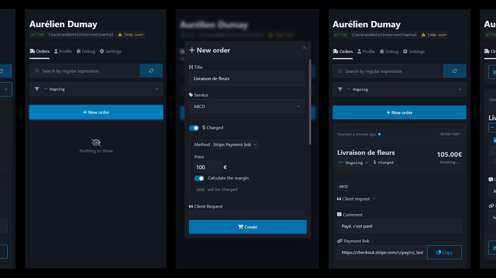

### Pitch

---
_[Clac des Doigts](https://clacdesdoigts.com/)_ is a digital concierge company. It makes the daily lives of its users 
easier by offering them a multitude of services; it responds to any request as long as it is legal and feasible.

As part of my internship, I had the chance to work on their order management software, with a fairly large autonomy. 
I continue, even today, to work on it as a freelancer.

The application is built as an extension of the _[Front](https://front.com/)_ CRM software, used by _Clac des Doigts_.

### Pictures

---

