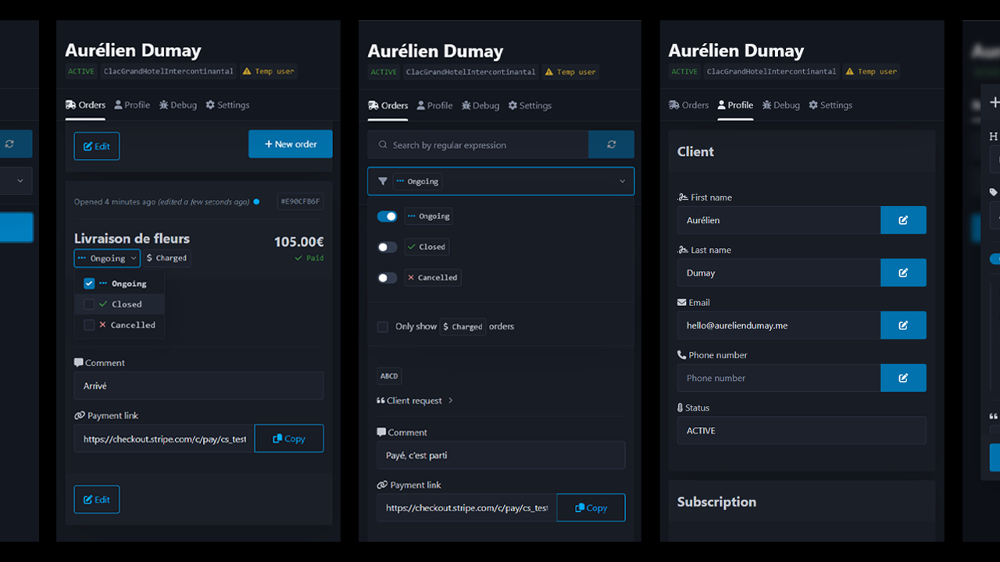
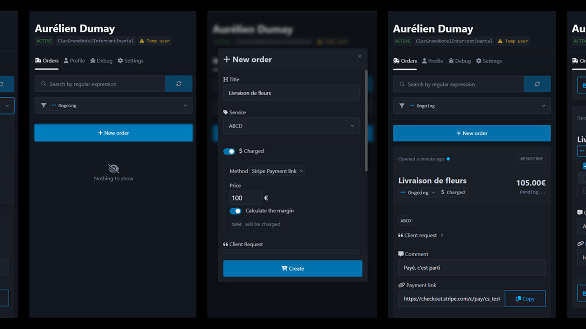

### Pitch

---
_[Clac des Doigts](https://clacdesdoigts.com/)_ est une entreprise de conciergerie digitale. Elle allège le quotidien
de ses utilisateurs en leur proposant une multitude de services répond à toute demande tant qu'elle est légale
et réalisable. 
Dans le cadre d'un mon stage, j'ai eu la chance de travailler sur leur logiciel de gestion de
commandes et en ayant une assez large marge de manœuvre. Je continue, encore aujourd'hui, à travailler dessus en
freelance.

L'application est construite sous la forme d'une extension du logiciel de CRM _[Front](https://front.com/)_, 
utilisé par _Clac des Doigts_.

### En images

---

