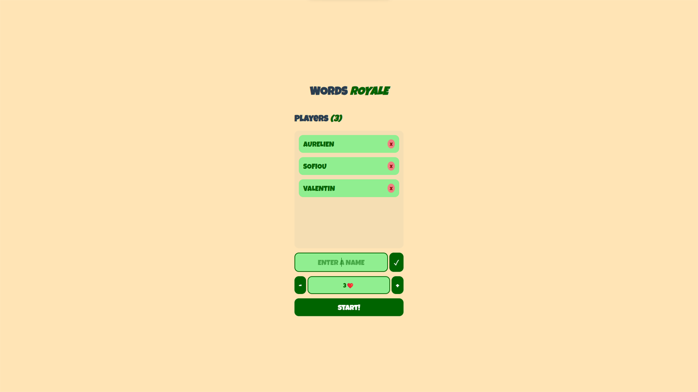
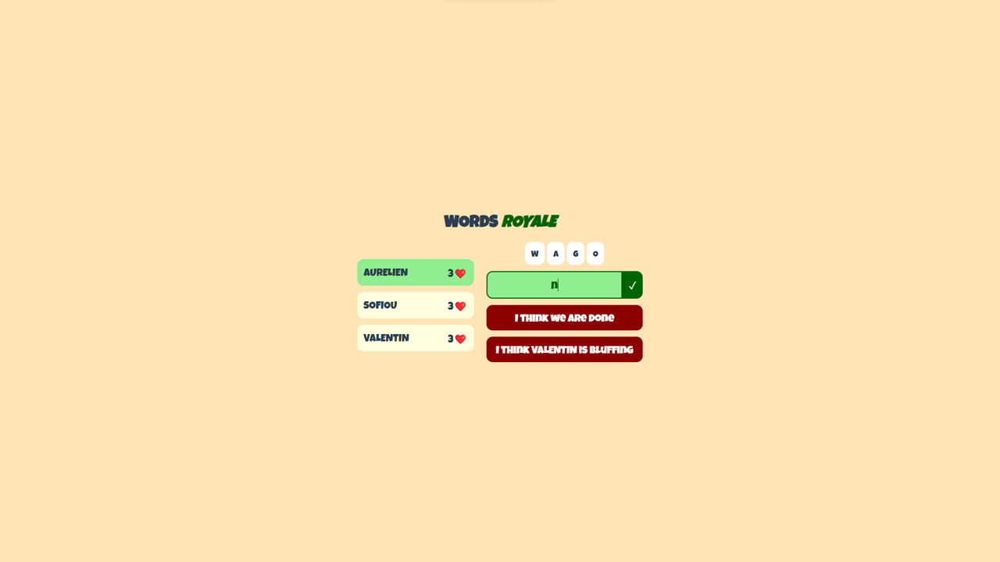

### Pitch

---

During an English boot camp at the beginning of my second year at _Epitech Digital_, we were tasked with designing a
small computer-based game to promote English learning. I chose to adapt the "quarts de singe" game, a playful French
activity often practiced verbally during long car journeys.

### Pictures

---

