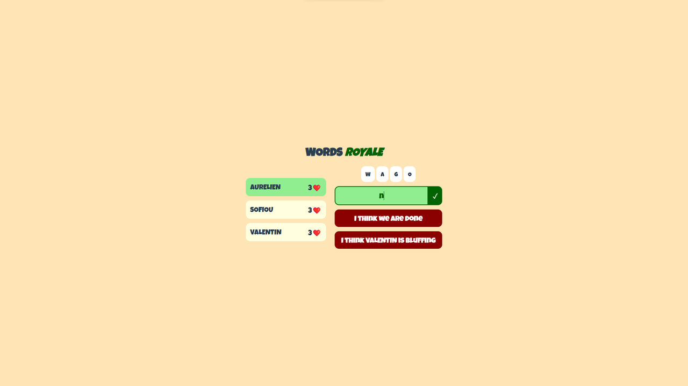

### Pitch

---
Pendant un bootcamp d'anglais au début de ma deuxième année à _Epitech Digital_, nous avons eu à concevoir 
un petit jeu sur support informatique visant à encourager l'apprentissage de l'anglais. 
Mon choix s'est porté sur une adaptation du jeu des "quarts de singe",
une activité ludique française fréquemment pratiquée à l'oral pendant des longs trajets en voiture.

### En images

---

